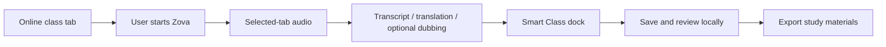
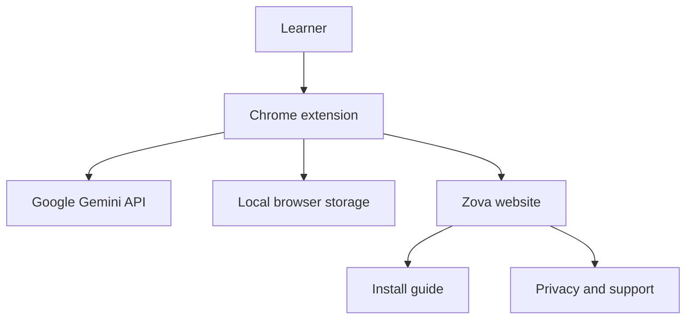

# ZOVA

### AI-powered real-time classroom assistant for Chrome

**Follow classes clearly. Learn in your language.**

[Open the product site](https://zovasite.vercel.app/) · [Install guide](https://zovasite.vercel.app/guide#install) · [Privacy](privacy.html) · [Support](support.html)

Zova is a free Chrome classroom assistant for learners who want to follow online lessons, understand difficult content and keep their study materials organised. It combines live transcription, translation, optional translated audio and focused study workflows in one lightweight classroom experience.

Features that use Google Gemini work with the user's own free Gemini API key, subject to Google's current quotas and terms. Zova does not require a paid Zova subscription for its own product features.

## Product capabilities

### Live classroom assistance

- Live transcription from the selected classroom tab
- Real-time translation into the learner's chosen language
- Optional translated audio / dubbing
- Smart Class explanations based on recent lesson context
- AI-assisted questions and answers
- Bounded lesson summaries
- Transcript font-size and classroom dock controls

### Saved study materials

- Manual and safe auto-save for active classes
- Local class history and searchable dashboard
- Original transcripts, translations and Smart Notes
- Vocabulary and chapter organisation
- Clean Study File generation where available
- Study Maps and detailed Study Guide views
- Markdown export plus manual backup and restore

## How it works

Explanations, answers and summaries use recent bounded classroom context and are initiated by the learner.

## Product architecture

## Privacy highlights

- Classroom capture starts only after the learner starts a session.
- Selected tab audio is processed only for requested classroom features.
- Saved classes and generated study materials remain in local browser extension storage where applicable.
- The user's Gemini API key is stored locally by the extension.
- Gemini keys are excluded from class backups.
- Zova does not sell user data or use classroom data for advertising.

Read the full Zova Privacy Policy in privacy.html.

## Website pages

| Page | Purpose |
|---|---|
| index.html | Product overview, feature explanation and real product screenshots |
| guide.html | Installation and first-class walkthrough |
| privacy.html | Privacy and data-use information |
| support.html | Installation and troubleshooting guidance |

## Local development

This is a dependency-free static HTML/CSS/JavaScript website.

~~~bash
python -m http.server 8080
~~~

Then open http://localhost:8080.

## Project structure

~~~text
zovasite/
├── index.html
├── guide.html
├── privacy.html
├── support.html
├── styles.css
├── script.js
├── favicon.svg
└── img/
~~~

## Support

For support, email info.zova24@gmail.com.

## Disclaimer

Zova is a learning assistant. It does not replace teachers, educational institutions or professional advice. Google, Chrome and Gemini are trademarks of their respective owners.

## Product links

- [Live website](https://zovasite.vercel.app/)
- [Installation guide](https://zovasite.vercel.app/guide#install)
- [Chrome extension repository](https://github.com/Vahid-Rahmani/dobzova)
- Chrome Web Store extension ID: `menedjcoiemocjmcjajjbcondloeinkh`

## Copyright

Copyright © 2026 Vahid Rahmani. All rights reserved.

**ZOVA · Learn clearly, in your language.**

